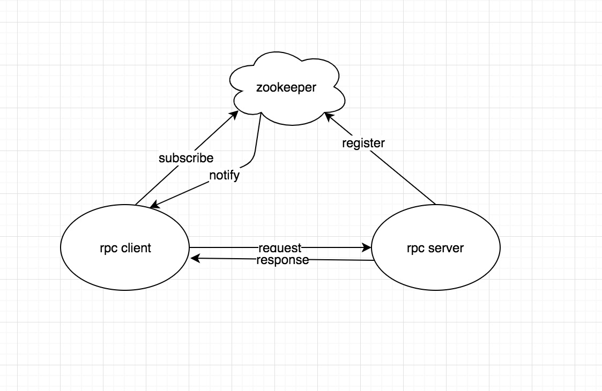

### 轻量级rpc框架——HupperRPC

#### 一、Project introduction：
* Spring manages the whole object, netty is responsible for message communication, and zookeeper is responsible for managing com.hupper.rpc.service registration.
* Support for asynchronous call com.hupper.rpc.service, support for callback function
* The client uses long connections.
* Server asynchronous multithread processing RPC request

#### 二、Project structure：
* Service publishing and subscription：The server uses Zookeeper to register the com.hupper.rpc.service address, and the client gets the available com.hupper.rpc.service address from Zookeeper.
* Spring：Using Spring configuration com.hupper.rpc.service, loading Bean, scanning notes。
* dynamic proxy：The client uses dynamic proxy mode to transparently invoke the com.hupper.rpc.service.




#### 三、Server publishing com.hupper.rpc.service
* Annotate services to be published using annotations

```
@Target({ElementType.TYPE})
@Retention(RetentionPolicy.RUNTIME)
@Component
public @interface RpcService {
    Class<?> value();
}
```
* A com.hupper.rpc.service interface:

```
public interface HelloService {

    String hello(String name);

    String hello(Person person);
}
```

* A com.hupper.rpc.service implementation: using annotation annotation

```
@RpcService(HelloService.class)
public class HelloServiceImpl implements HelloService {

    @Override
    public String hello(String name) {
        return "Hello! " + name;
    }

    @Override
    public String hello(Person person) {
        return "Hello! " + person.getFirstName() + " " + person.getLastName();
    }
}
```
* When the com.hupper.rpc.service is started, all the com.hupper.rpc.service interfaces and their implementation are scanned.

```
	@Override
    public void setApplicationContext(ApplicationContext ctx) throws BeansException {
        Map<String, Object> serviceBeanMap = ctx.getBeansWithAnnotation(RpcService.class);
        if (MapUtils.isNotEmpty(serviceBeanMap)) {
            for (Object serviceBean : serviceBeanMap.values()) {
                String interfaceName = serviceBean.getClass().getAnnotation(RpcService.class).value().getName();
                handlerMap.put(interfaceName, serviceBean);
            }
        }
    }
```
* test code  

```
   /**
   RpcClient 属于rpc框架内部一个类，可直接spring注入
   */
 	@Autowired
    private RpcClient rpcClient;

    @Test
    public void helloTest() {
        HelloService helloService = rpcClient.create(HelloService.class);
        String result = helloService.hello("World");
        Assert.assertEquals("Hello! World", result);
    }
   
```
```

 		ServiceDiscovery serviceDiscovery = new ServiceDiscovery("127.0.0.1:2181");
		final RpcClient rpcClient = new RpcClient(serviceDiscovery);
		// Sync call
		HelloService helloService = rpcClient.create(HelloService.class);
		String result = helloService.hello("World");
		// Async call
		IAsyncObjectProxy client = rpcClient.createAsync(HelloService.class);
		RPCFuture helloFuture = client.call("hello", "World");
   		String result = (String) helloFuture.get(3000, TimeUnit.MILLISECONDS);

```

#### Performance improvement
* 1、Server request asynchronous processing. 
	*  Netty itself is a high-performance network framework, and there is not much problem in terms of network IO. From the RPC framework itself, the server-side processing of requests is changed to multithreaded asynchrony on the basis of the original.
* 2、Management of com.hupper.rpc.service end connection
	* The client maintains a long connection with the com.hupper.rpc.service, does not need to connect every time the com.hupper.rpc.service is invoked, and manages the long connection (through Zookeeper to get a valid address).By monitoring the changes in the value of Zookeeper com.hupper.rpc.service nodes, the long connections between the client and the server are dynamically updated. This is now done on the client side, which maintains a long connection to all available services, putting pressure on both the client and the server to decouple the implementation. 
* 3、Client request asynchronous processing
	* The client requests support for asynchronous processing without synchronous waiting: Sends an asynchronous request, returns the Feature, and gets the result through the Feature's callback mechanism 


#### Wait for updates
* Multi protocol support for encoding serialization.
* Zookeeper built in com.hupper.rpc.service internally，Simplified deployment


